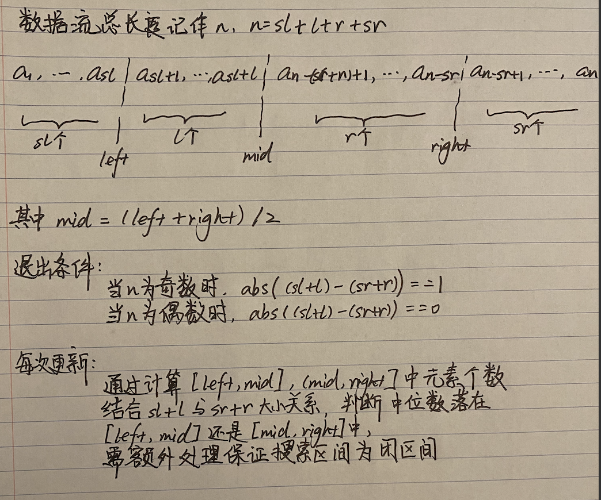
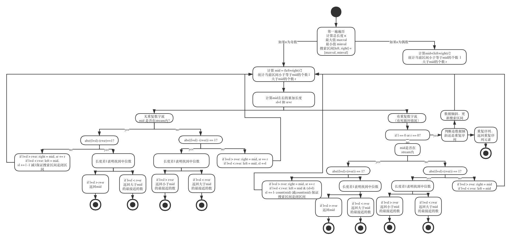
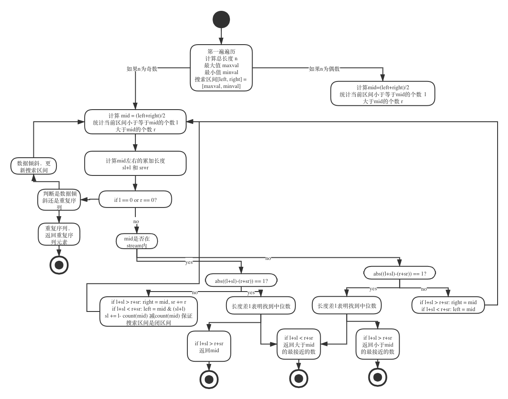
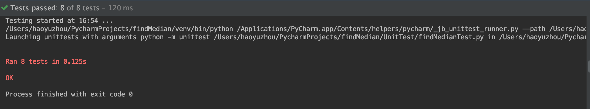

# Find a median number of infinite stream

### 0. 概述

存在一个无限数据流 ***[a1, a2, ..., an-1, an]***，请找出无限数据流的中位数 ***mediam***

限制条件：1. 不存在外部存储空间  2. 内存大小远小于数据流大小

允许条件：1. 可重复读写数据流


### 1. 思路

使用二分搜索算法搜索中间值，记当前搜索区间 ***[left, right]*** ,   ***sl*** 和 ***sr*** 表示当前搜索区间外，对应左边个数和右边个数， ***l*** 和 ***r*** 表示当前搜索区间内，小于等于mid的个数，和大于mid的个数

根据 ***sl+l*** 和 ***sr+r*** 大小关系，判断中位数***mediam*** 在 ***[left, mid]*** 或者 ***[mid,right]***




算法复杂度近似于***O(logN)***，N为数据流总长度

由于各种Edge Case，需要判断极端值，故整体思路，先利用 ***状态机*** 穷举，再剪枝或者合并状态


 ### 2. 难点

1. 不存在数组下标，需要通过搜索区间 ***[left, right]*** 的左右边界来计算 mid，但存在mid落在边界上的情况，或者mid本身不在数据流里，需要判断和单独处理
2. 数据流长度奇偶会影响中位数的取值，一般地，偶数时 medium = (a<sub>n//2</sub> + a<sub>n//2+1</sub> ) /2，奇数时medium = a<sub>n//2+1</sub>，算法需要对奇偶单独处理
3. 数据流可能出现重复数据，重复数据的出现加上mid可能落在边界上，带来判断的困难
4. 可能出现死循环（数据倾斜或者陷入搜索区间元素一致情况，后续详细说明）


### 3. 详解

这里因为各种特殊情况需要处理，算法直接编写易出错，考虑使用状态机思想辅助算法判断




上图展示了当数据流长度为奇数时，穷举可能状态，

其中主要为，数据流总长度是否为奇偶，是否是包含重复数字的数据流，所检索的mid是否本身在数据流中

1. 判断数据流奇偶性，定义搜索区间[left, right] = [minval, maxval]，初始化 l = r = sl = sr = 0, 其中 sl，sr表示目前搜索区间外的左右累加长度

2. 计算中间值mid，统计 ***当前区间*** 小于等于mid 和 大于mid的个数，分别计作 l ，r

3. 判断是否是重复数据流，若不是，则计算

  > abs( (l+sl) - (r+sr)) == 1

  若等式成立，此时 a<sub>mid</sub> 将整个数据流划分成长度相差为1的两个部分，那么根据a<sub>mid</sub>本身是否在数据流内，就可以判断具体中位数

  若等式不成立，假设 l+sl > r+sr （此时l+sl 至少比 r+sr 大3），且mid不在数据流类，记|mid|，类似隔板，但本身不在

  a<sub>1</sub>, a<sub>2</sub>, ... , a<sub>sl</sub>, a<sub>sl+1</sub>, ... , a<sub>sl+l</sub>, |mid|, a<sub>n-r-sr+1</sub>, a<sub>n-r-sr+2</sub>,...,a<sub>n</sub>

  可见下次的搜索区间应该在 [a<sub>sl+1</sub>, a<sub>sl+l</sub>], 同时更新已经可以确定右区间，及a<sub>sl+l</sub>右侧长度，sr = sr + r

  这里，如果mid在数据流内，根据计数标准小于等于mid -> l = l+1, 大于mid -> r=r+1，则***更新左区间时候需要减1***，保证下次搜索区间是闭区间

  如果mid不在数据流内，则直接left = mid, sl = 或者 mid = right，

4. 判断是否是重复数据流，若是，则计算

	整体思路类似步骤3，但***更新左区间时候需要减count(mid)***，保证下次搜索区间是闭区间

5. 判断是否存在数据倾斜和重复序列的情况

	1. 数据倾斜

		假设存在sl == sr, 且left = 630, right = 690,  计算得mid = 660，而此时搜索区间里还剩[671, 673, 679]，会有所有数大于mid,导致r+3，但无法退出情况，此时 abs((sl+l) - (sr+r)) == 3

		解决思路在于出现 l == 0 or r == 0时，判断是否存在数据倾斜，如果是，则手动缩短搜索区间到[671, 679]，即left = 区间内最小值，right = 区间内最大值

	2. 重复序列

		如果最终的median刚好是重复的，那么会出现死循环，left, right会无限逼近median，但无法满足退出条件 **abs( (l+sl) -(r+sr)) == 1**

		此时记重复的中位数为a<sub>mid</sub>，搜索区间一定会向a<sub>mid</sub>逼近，则有

		> a<sub>1</sub>,a<sub>2</sub>,...,a<sub>mid-1</sub>,|left|,a<sub>mid</sub>,a<sub>mid</sub>,...,a<sub>mid</sub>,a<sub>mid</sub>,|right|,a<sub>mid+1</sub>,...a<sub>n</sub>,

		假设存在sl == sr, 且left = 2.9, right = 3.1, 计算得mid = 3, 而此时搜算区间内还剩[3, 3, 3, 3, 3,..., 3, 3]，无论如何更新mid, 会导致如数据倾斜一样无法退出的情况

		解决思路在于此时也会出现 l == 0 or r == 0，left = 区间最小值，right = 区间最大值，如果 left == right, 返回left即为结果


当对于数据流长度为偶数时，也做类似穷举


### 4. 简化过程

1. 当mid在数据流里，如果要更新左区间，需要去掉mid个数，保证下一个搜索区间是闭区间, 如果非重复数据流，mid只会出现1次，故减去1，重复数据流，减去 count(mid)，所以在遍历时，都剪去count(mid)即可

2. 有些计算 数据流中比mid小的第一个数，或者比mid大的第一个数，代码可以重复使用，对应上述相同状态可以合并


剪枝后，数据流长度为奇数




### 5. 文件结构和变量申明

```
- src
	| - findMedian.py  	  		源代码
- UnitTest
	| - findMedianTest.py			测试用例
	| - stream.py							数据流生成
```


其中stream可以生成4种数据流，

相同数字数据流

自然数数据流，随机洗牌打乱顺序 [1, 3, 4, 2, ..., n]

随机序列数据流且元素可重复, 使用rand()函数实现，如 [5, 99, 3, ..., 27, 27..., 81, 27]

随机序列数据流且元素不可重复, 使用rand()函数和集合set() 实现，如 [5, 99, 3, ..., 27..., 81]


### 6. 测试用例

一共8个单元测试用例，在目录 UnitTest/findMedianTest 下

```python
# 奇数个相同数据流，一个测试用例重复测试1次
test_same_stream_odd

# 偶数个相同数据流，一个测试用例重复测试1次
test_same_stream_even

# 奇数个连续数据流[1,2,...,2k+1], 一个测试用例重复测试1次
test_continuous_stream_odd

# 偶数个相同数据流[1,2,...,2k], 一个测试用例重复测试1次
test_continuous_stream_even

# 奇数个相同数据流，其中元素不重复[a1,a2,...,a2k,a2k+1]， 一个测试用例重复测试20次
test_random_unrepeatable_stream_odd

# 偶数个相同数据流，其中元素不重复[a1,a2,...,a2k-1,a2k]， 一个测试用例重复测试20次
test_random_unrepeatable_stream_even

# 奇数个相同数据流，其中元素可重复[a1,a2,...,a2k,a2k+1]， 一个测试用例重复测试20次
test_random_repeatable_stream_odd

# 偶数个相同数据流，其中元素可重复[a1,a2,...,a2k-1,a2k]， 一个测试用例重复测试20次
test_random_repeatable_stream_even
```


 累计84个测试，全通过




### 7. 后续改进

1. 数据流长度为n，判断奇数和偶数后，仍有部分状态重复，可以考虑合并。但合并后，可读性和代码可维护性下降，有待商榷。
2. 生成不可重复的数据流时，使用了rand()和集合set()，去除重复元素，如果节约空间，可以使用布隆过滤器代替set()